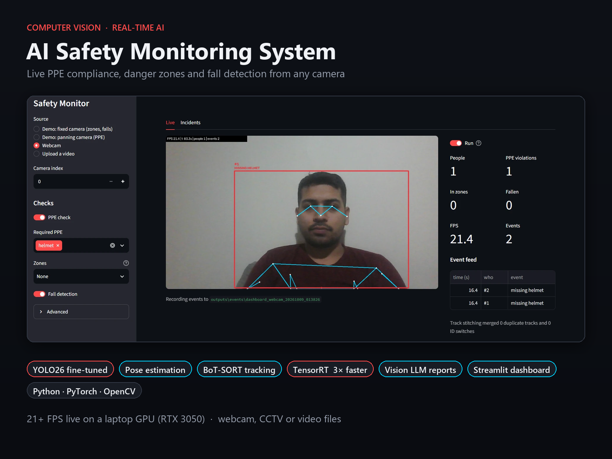

# AI Safety Monitoring

Real-time computer vision for workplace cameras: flags missing PPE, danger-zone entry and
falls, and writes an incident report for each alert with a vision-language model.



- **Detection:** YOLO26 fine-tuned on construction PPE (0.84 mAP50 vs 0.66 for the best
  zero-shot model)
- **Rules on top:** pose keypoints + BoT-SORT tracking turn detections into events: missing
  helmet (judged only when the head is visible), restricted zones, dwell time, occupancy, falls
- **Fast:** TensorRT export, 3x faster at the same accuracy; 21+ FPS live on a laptop RTX 3050
- **Reports:** a vision LLM (MiniMax via OpenRouter, or Claude) reviews each alert and writes a
  structured incident report for about $0.0004
- **Dashboard:** Streamlit app for a webcam, CCTV stream or video file

More slides: [what it detects](portfolio/02_detections.png) · [measured results](portfolio/03_results.png)

## Quick start

```bash
conda create -n safety python=3.11 -y
conda activate safety
pip install torch torchvision --index-url https://download.pytorch.org/whl/cu128
pip install -r requirements.txt

python src/stage2_prepare.py          # download the PPE dataset
python src/stage2_train.py            # fine-tune the PPE model (~50 min on an RTX 3050)
python src/make_demo_video.py --mode scene
streamlit run src/dashboard.py --server.address localhost
```

Trained weights, datasets and outputs aren't in the repository (see `.gitignore`); the
commands above recreate them. For incident reports, put `OPENROUTER_API_KEY=...` (or
`ANTHROPIC_API_KEY=...`) in a `.env` file in the project folder (Stage 8). TensorRT is optional
(see "TensorRT" below).

Developed on Windows 11 with Python 3.11, PyTorch 2.9 + CUDA 12.8 on an RTX 3050 Laptop GPU (4 GB).

## License

**Proprietary - All Rights Reserved.** This code is published for portfolio and demonstration
purposes only. It may not be used, copied, modified or distributed, for any purpose, without a
paid written license from the author. See [LICENSE](LICENSE). For licensing, contact
[@nusRying](https://github.com/nusRying).

Never commit your `.env` file: it holds your API keys and is excluded by `.gitignore`.

## Layout

```
src/        stage scripts (common.py = shared video, tracking and event-log helpers)
configs/    zone definitions, tracker settings
portfolio/  project slides (make_portfolio.py rebuilds them)
models/     downloaded / trained weights (git-ignored)
data/       datasets and sample videos (git-ignored)
outputs/    annotated images, videos, reports (git-ignored)
```

The sections below walk through the project stage by stage, with what was measured at each
step, including what didn't work and why.

## Roadmap

| # | Stage | Status |
|---|-------|--------|
| 1 | Pretrained YOLO detection on webcam / video | ✅ `src/stage1_detect.py` |
| 2 | Fine-tune on a PPE dataset (helmet, vest) | ✅ `src/stage2_prepare.py`, `src/stage2_train.py` |
| 3 | Zero-shot detection (YOLOE / Grounding DINO) | ✅ `src/stage3_zeroshot.py` |
| 4 | Multi-object tracking + PPE rules | ✅ `src/stage4_track.py`, `src/make_demo_video.py` |
| 5 | Danger zones, dwell time, occupancy | ✅ `src/stage5_zones.py` |
| 6 | Pose-based fall detection | ✅ `src/stage6_fall.py` |
| 7 | SAM 2.1 segmentation + auto-labelling | ✅ `src/stage7_segment.py` |
| 8 | VLM incident reports (MiniMax via OpenRouter, or Claude) | ✅ `src/stage8_report.py` (needs an API key) |
| 9 | Combined pipeline + Streamlit dashboard | ✅ `src/pipeline.py`, `src/dashboard.py` |
| + | TensorRT export (~3x faster inference) | ✅ `src/export_trt.py` |

## Stage 1 - Detection

```bash
python src/stage1_detect.py                       # webcam
python src/stage1_detect.py --source path/to/video.mp4 --save
python src/stage1_detect.py --source path/to/image.jpg --save
python src/stage1_detect.py --classes person      # filter classes
python src/stage1_detect.py --model yolo11n.pt    # compare models
```

Keys: `q` quit, `+`/`-` change confidence threshold, `s` save snapshot.

### Things to try

1. **Confidence threshold.** Press `-` until the threshold is around 0.10. More boxes
   appear, many of them wrong (false positives). Press `+` up to 0.80 and real objects
   start disappearing (false negatives). This is the precision/recall trade-off.
2. **Model size.** Run `yolo26n.pt`, `yolo26s.pt` and `yolo26m.pt` on the same video and
   compare FPS against how many objects are found. On 4 GB VRAM, `n` and `s` are the
   practical choices for real time.
3. **YOLO26 vs YOLO11.** YOLO11 uses NMS (non-max suppression) to remove duplicate boxes,
   so `--iou` changes its output. YOLO26 is NMS-free (end-to-end), so `--iou` has no effect.
   Try `--model yolo11n.pt --iou 0.9` to see duplicate boxes appear.
4. **Image size.** `--imgsz 320` is faster but misses small or distant people. `--imgsz 1280`
   is the opposite.
5. **Limits.** The COCO model has no "helmet" or "vest" class. Stage 2 fixes that.

### Concepts

- **Bounding box:** `[x1, y1, x2, y2]` in pixels, plus a class id and a confidence score.
- **IoU (Intersection over Union):** overlap between two boxes, from 0 to 1. Used to match
  predictions to ground truth and to remove duplicates.
- **NMS:** keeps the highest-confidence box and drops others that overlap it above the IoU
  threshold.
- **mAP:** the standard detector metric, covered in Stage 2 when we train and evaluate.

## Stage 2 - Fine-tuning on PPE

Dataset: [Construction-PPE](https://docs.ultralytics.com/datasets/detect/construction-ppe)
(1,416 images, 11 classes: `helmet gloves vest boots goggles none Person no_helmet no_goggle
no_gloves no_boots`).

```bash
python src/stage2_prepare.py          # download, class counts, ground-truth previews
python src/stage2_train.py            # 50 epochs of yolo26n, about 50 min on an RTX 3050
python src/stage2_train.py --eval-only models/ppe_yolo26n.pt
python src/stage1_detect.py --model ppe_yolo26n.pt   # live PPE detection, violations in red
```

Outputs:
- `outputs/stage2_samples/`: training images with their labels drawn. Look at these first.
- `runs/ppe/yolo26n/`: `results.png` (loss and mAP curves), `confusion_matrix.png`,
  `BoxPR_curve.png`, `val_batch*_pred.jpg` (predictions next to labels).
- `models/ppe_yolo26n.pt`: the best checkpoint.

### Concepts

- **Transfer learning:** we start from COCO weights, so the network already knows edges,
  textures and people. Only about 1,100 images are needed to teach it helmets and vests.
  Training from scratch (`--model yolo26n.yaml`) would need far more data.
- **Train / val / test:** train adjusts the weights, val picks the best epoch and drives early
  stopping, and test is held back for one honest final score.
- **Loss curves:** in `results.png`, if train loss keeps falling while val loss rises, the
  model is overfitting (memorising instead of generalising).
- **Precision vs recall:** precision is "of the boxes I drew, how many were right"; recall is
  "of the real objects, how many did I find".
- **mAP50 / mAP50-95:** average precision across classes. mAP50 counts a box as correct at
  IoU >= 0.5; mAP50-95 averages over stricter thresholds up to 0.95, so it rewards tight boxes.
- **Augmentation:** Ultralytics applies mosaic, flips, HSV shifts and scaling during training
  (see `val_batch` vs `train_batch*.jpg`) so the model sees more variety than the raw images.

### Things to look at

1. **Class imbalance.** `no_boots` has only 88 training boxes versus 1,770 for `Person`. Check
   its per-class mAP in the test results. Rare classes almost always score worst.
2. **Label noise.** Some workers in the background have no labels (see
   `outputs/stage2_samples/image32_gt.jpg`). The model gets penalised for "correctly" finding
   them, which caps the achievable precision.
3. **Confusion matrix.** Which classes get mixed up? `helmet` vs `no_helmet` is the one that
   matters for safety.
4. **Bigger model.** Train `--model yolo26s.pt --batch 8` and compare mAP and FPS with `n`.

### Results (yolo26n, 50 epochs, test split)

| | mAP50 | | mAP50 |
|---|---|---|---|
| helmet | 0.935 | no_helmet | 0.236 |
| vest | 0.910 | no_goggle | 0.221 |
| Person | 0.828 | no_gloves | 0.113 |
| gloves | 0.801 | no_boots | 0.035 |

Overall mAP50 0.549, mAP50-95 0.273. The model is good at finding PPE and poor at finding
its absence: the confusion matrix shows 77-88% of `no_*` objects predicted as background.
Detecting an absence is hard, and those classes have few examples. Stage 4 works around this
with a rule.

## Stage 3 - Zero-shot detection

```bash
python src/stage3_zeroshot.py --source img.jpg --prompts person "hard hat" ladder --save
python src/stage3_zeroshot.py --backend gdino --source img.jpg --prompts "fire extinguisher"
python src/stage3_zeroshot.py --eval                  # vs the fine-tuned model
python src/stage3_zeroshot.py --eval --backend gdino
```

- **YOLOE-26:** a YOLO detector whose class layer is generated from text. MobileCLIP encodes
  each prompt once, then detection runs at normal YOLO speed.
- **Grounding DINO:** a transformer that reads image and text together (cross-attention), so
  it handles odd prompts better, at a much higher cost per frame.

### Zero-shot vs fine-tuned (PPE test set, 141 images)

| model | mAP50 | mAP50-95 | FPS | person | hard hat | safety vest | gloves |
|---|---|---|---|---|---|---|---|
| YOLOE-26s, zero-shot | 0.513 | 0.206 | 21 | 0.683 | 0.504 | 0.500 | 0.365 |
| Grounding DINO tiny, zero-shot | 0.664 | 0.293 | 2 | 0.739 | 0.680 | 0.690 | 0.546 |
| **yolo26n fine-tuned** | **0.844** | **0.477** | **25-35** | 0.812 | 0.914 | 0.882 | 0.766 |

(Scored with supervision's mAP, which differs slightly from Ultralytics' numbers in Stage 2.)

Takeaway: ~1,100 labelled images beat a general model on its home turf, and the fine-tuned
model is also the fastest. Zero-shot is for things you have no labels for yet: try
`ladder`, `forklift` or `fire extinguisher`, then use its detections to bootstrap a dataset
(auto-labelling) and fine-tune.

Things to try: prompt wording matters ("hard hat" vs "helmet" vs "construction helmet"); run
`--eval` with different prompts by editing `EVAL_PROMPTS`.

## Stage 4 - Tracking and PPE rules

```bash
python src/make_demo_video.py                         # pan across two test images -> demo_site.mp4
python src/stage4_track.py --source data/samples/demo_site.mp4 --save
python src/stage4_track.py                            # webcam
python src/stage4_track.py --require helmet vest
python src/stage4_track.py --tracker bytetrack.yaml   # compare trackers
python src/stage4_track.py --head-check box           # compare head rules: pose (default), box, off
```

How it decides:
1. Detect people and PPE items with the fine-tuned model.
2. Track people (BoT-SORT) so each keeps an ID. People under `--min-height` px are skipped.
3. A person "has" an item if an item box centre lies in the right body band
   (helmet: top 30% of the person box; vest: 15-70%).
4. Each person keeps the last `--window` frames of results. After `--min-frames` frames they
   are flagged if the item was missing in >= `--ratio` of them.
5. **Head cut-off rule:** helmets and goggles are only judged in frames where the head is in
   view, checked with a pose model's head keypoints. Other frames are skipped, not counted as
   "missing" (see below).
6. New violators are written to `outputs/events/stage4_<video>_<time>/events.csv` with a crop
   of the person and the full frame. Stage 8 will send these to a vision LLM.

Green = OK, red = violation, grey = still checking or `HEAD HIDDEN`. The lines are each
person's track history.

### Concepts

- **Tracking by detection:** detect every frame, then match new boxes to existing tracks.
  A Kalman filter predicts where each track should be, and boxes are matched by IoU with that
  prediction (Hungarian algorithm).
- **ByteTrack's trick:** low-confidence boxes (down to 0.1) are used in a second matching pass
  to keep existing tracks alive through occlusion, but never start new tracks. So `--track-conf`
  is kept low and PPE items use the stricter `--conf`.
- **BoT-SORT:** ByteTrack plus camera-motion compensation (it estimates how the whole image
  shifted and corrects the Kalman predictions). It helps on moving or panning cameras.
- **Extra IDs:** one person can end up with several track IDs, and every new ID can raise the
  same alarm again. Two causes: an *ID switch* (the tracker loses someone and gives them a new
  ID when they reappear) and a *duplicate track* (the detector puts two boxes on one person and
  the tracker follows both). Track stitching, below, handles both.
- **Temporal smoothing:** judging over a window of frames instead of one frame trades alert
  delay for fewer false alarms.

### What we measured on the demo clip

- ByteTrack at conf 0.3: 33 person IDs for roughly 15 real people; 19 lasted under 30 frames.
- BoT-SORT with low-conf boxes kept: 30 IDs, 14 short-lived. (These were first blamed on ID
  switches; the track stitching work below found they were almost all duplicate tracks.)
- `--min-frames` 5 -> 15 cut events from 15 to 10 but missed one real violator who only
  appeared in the last half-second.
- Checked against the full frames, those 10 are 7 real and 3 false. (Track #163 was first
  counted as false from its close-up alone; the full frame shows a jumping player with no
  helmet. Always label from enough context.) The false ones: a 38 px sliver of a person at the
  left edge, and two workers whose pink helmets the PPE model misses.

### Track stitching: one person, one alarm

`common.TrackStitcher` gives each person a canonical ID, however many track IDs the tracker
uses for them. Events, violator counts, people counts and zone occupancy all use the canonical
ID. It's on in Stages 4, 5, 6 and the pipeline (`--no-stitch` to compare), and each run prints
what it linked. Re-linked tracks are labelled `#new=old` on screen.

| case | merged when |
|---|---|
| new track on top of an existing one (duplicate) | box IoU >= 0.6, similar colours, and both heads seen in the same place |
| two existing tracks (duplicate that shows up later) | as above for 5 frames in a row |
| new track where one was just lost (ID switch) | lost <= 2 s ago, centre within 0.75 x person height, similar size and colours |

"Similar colours" is a hue/saturation histogram of the middle of the body: a crude but cheap
re-identification feature. Head positions come from the pose model: in the pipeline from each
person's own keypoints, in Stages 4 and 5 from the pose detection each tracked box overlaps most.
If either head isn't seen, the two tracks are kept apart. Only when no pose model runs at all
(Stage 4 with `--head-check box` or `off`, Stage 5 zones without a `require` rule) do overlap and
colour decide a new-track duplicate on their own.

**What it found.** On the panning demo the extra IDs were almost all **duplicate tracks**, not ID
switches (Stage 4: 12 duplicates, 0 switches; with TensorRT: 13 duplicates, 1 switch). YOLO26 is
NMS-free (Stage 1), so it has no final pass that removes overlapping boxes, and occasionally two
boxes on one person both survive. The tracker then follows both.

**How it was tuned, and what went wrong on the way:**
- Tracker settings didn't help: a longer `track_buffer` changed nothing, and BoT-SORT's
  built-in ReID (`with_reid`, using detector features) made it worse, 41 IDs instead of 30.
- Overlap alone can't separate a duplicate from two people standing close: links between true
  duplicates and between different people both had IoU 0.52-0.70. **Head position can**: a
  duplicate shares one head, two people have two. In the line of hard-hat workers the head
  check blocked links between neighbours whose boxes overlapped.
- A pair of soldiers, one bending over in front of the other, first looked like a wrong merge.
  The keypoints showed both tracks had the standing man's head; the bending soldier, head down
  and hidden, was never detected as a person at all. So the merge was right and the earlier
  count of "two violators" there was wrong. The bending soldier is a detection miss (occlusion)
  with or without stitching.
- The first version of the "two existing tracks" rule let overlap and colour decide when no
  head was known, and it merged two neighbouring workers in identical vests. Both duplicate
  rules now need both heads seen in the same place: positive evidence before two tracks become
  one person.

**Results** (events labelled by eye from the full frames):

| run | before | with stitching |
|---|---|---|
| Stage 4, panning demo, PyTorch | 7 real + 1 false | unchanged |
| Stage 4, panning demo, TensorRT | 7 real + 2 false (one worker twice) | 7 real + 2 false (see below) |
| pipeline, panning demo (PyTorch and TensorRT) | 7 events, one person twice | **6 events: 5 people + 1 false** |
| fixed-camera demo, all stages, both backends | 5 / 2 / 2 events | unchanged |
| dashboard people counter, fixed-camera demo | over by one in 18 frames | over by one in 10 frames (0.4 s, while someone walks in at the edge) |

**The trade-off: which mistake to prefer.** An earlier version merged a new track on overlap
and colour alone when the pose model saw no head for either. That fixed the TensorRT duplicate
(7 real + 1 false), because the duplicated worker is the one whose head is cut by the join
between the two photos. But in a tight crowd of identically dressed people with hidden faces,
the same rule can attach a new track to the wrong neighbour and silently suppress that
neighbour's later alarm. Requiring both heads trades that risk for the occasional duplicate
alarm when a head isn't visible. A duplicate alarm is a nuisance someone can dismiss (and Stage
8's review can flag); a wrongly merged track hides a real violation. So both heads are required.

### Head cut-off rule

You can't judge a helmet on a head you can't see. Without this rule, a person whose head is
outside the picture (or not detected) counts as "no helmet" every frame and soon gets flagged.
With it, those frames are skipped and the person shows `HEAD HIDDEN` until they can be judged.
Frames are skipped rather than counted as OK, so someone can't avoid a violation by staying at
the edge; they just aren't judged yet.

Two tests, both in `stage4_track.py`:

| test | how | used by |
|---|---|---|
| `head_in_frame_keypoints` | >= 2 of 5 head keypoints (nose, eyes, ears) with conf >= 0.5 inside the frame, and box top clear of the frame top | Stages 4 and 5 (default), pipeline / dashboard |
| `head_in_frame_box` | person box doesn't touch the top, left or right frame edge | Stages 4 and 5 with `--head-check box`, and as their fallback |

**How Stages 4 and 5 get keypoints.** Both track people with the PPE model, which has no
keypoints. `HeadChecker` (in `stage4_track.py`, used by both) also runs `yolo26n-pose` on each
frame (Stage 5 only when a zone has a `require` rule) and pairs its people with the
tracked people by box overlap: `match_boxes` builds an IoU matrix between the two sets of boxes
and solves it one-to-one with the Hungarian algorithm (`scipy.optimize.linear_sum_assignment`),
keeping pairs with IoU >= 0.3. Two models never draw exactly the same box for a person, so
matching by "same box" wouldn't work. A tracked person with no pose match falls back to the box
test. On the demo, 84% of person-frames were judged by keypoints and 16% by the fallback. The
pose model costs about 35 ms per frame (250 frames: 24.5 s without it, 34.0 s with).

Measured on `demo_site.mp4`, labelling every event by eye from the full frame:

| | real violations caught | false alarms |
|---|---|---|
| Stage 4, `--head-check off` | 7 / 7 | 3 |
| Stage 4, `--head-check box` | 6 / 7 | 2 |
| **Stage 4, `--head-check pose` (default)** | **7 / 7** | **1** |
| Stage 5, whole-frame zone with `require: ["helmet"]`, each mode | same as Stage 4, event for event | |
| pipeline, `--no-head-check` | 6 / 6* | 8 (+1 unclear edge sliver) |
| **pipeline, keypoint rule (default)** | **6 / 6*** | **1** |

\* Measured before track stitching. Two of those six alarms turned out to be the same person
(the standing soldier, with a duplicate track), so it's 5 people. With stitching the pipeline
raises 6 alarms: those 5 people once each, plus the 1 false alarm.

- The **box test** is coarse. It removed the edge-sliver false alarm but also skipped a real
  violator standing at the right edge with his face in full view, and the clip ended before he
  moved in.
- The **keypoint test** asks the real question ("is the head visible?") and handled both cases:
  the sliver is skipped, the man at the edge is judged (and so is the jumping player, 1.2 s
  earlier than with the box test). In Stage 4 it also removed one of the two pink-helmet false
  alarms (#88): that worker's box is nowhere near an edge, so the box test passes them, but the
  pose model found no confident head keypoints, so their helmet was never judged.
- In the pipeline it also removed 7 false alarms the box test couldn't. On the purple-tinted
  photo the pose model's boxes for the hard-hat workers start at the shoulders, so their helmets
  fell outside the "head band" and were counted missing. Their head keypoints are
  low-confidence, so the rule now skips them instead.
- The one false alarm left in both is a worker whose pink helmet the PPE model misses while
  their head is in view. That's a detector problem (more training data); no rule should hide it.
- Cost: judgements start a little later for people walking in from an edge (the fixed-camera
  demo's helmet alert moved from 1.2 s to 1.5 s), and in Stages 4 and 5, the pose model's
  ~35 ms/frame.

## Test clip for Stages 5 and 6

Zones only make sense with a fixed camera, so `make_demo_video.py --mode scene` builds one:
an empty yard, plus two people cut out of photos with `yolo26n-seg` (instance segmentation)
and animated. The man without a helmet walks to the middle of the yard and lingers from 4 s
to 9 s; the worker on the right falls over at 6 s and stays down.

```bash
python src/make_demo_video.py --mode scene     # -> data/samples/demo_scene.mp4
```

The best test is your own webcam: it's a fixed camera too.

## Stage 5 - Zones

```bash
python src/stage5_zones.py --source data/samples/demo_scene.mp4 --save
python src/stage5_zones.py --draw --source 0 --zones configs/zones_webcam.json   # draw your own
python src/stage5_zones.py --source 0 --zones configs/zones_webcam.json
python src/stage5_zones.py --head-check box     # head cut-off rule for zone PPE: pose (default), box, off
```

Zones live in `configs/zones_*.json`. Points are fractions of the frame (0-1), so a zone drawn
on a 640x480 webcam frame still fits at 1920x1080. Rules per zone:

| key | effect |
|---|---|
| `restricted: true` | anyone inside for more than `--grace-s` (0.5 s) is an event |
| `max_dwell_s: 3` | event when one visit lasts longer than 3 s |
| `max_occupancy: 1` | event when more than 1 person is inside |
| `require: ["helmet"]` | Stage 4's PPE rule, with its head cut-off check, applied only inside this zone |

The demo zone ("Crane swing area") has a 3 s dwell limit, a capacity of 1 and requires a
helmet. Result: `no helmet in Crane swing area` at 2.5 s and `in Crane swing area > 3s` at 5.6 s.
The head check doesn't change these: the man's head is always in view while he's in the zone
(pose keypoints judged 95% of person-frames). A zone at the edge of a real camera view, where
people are often half in frame, is where it matters.

### Concepts

- **Anchor point:** a person is "in" a zone when the bottom-centre of their box (their feet) is
  inside. The box centre would be wrong: someone standing behind the zone overlaps it in the
  image. The dot under each person shows the anchor.
- **Dwell time:** per (zone, track ID), reset when the person leaves. It depends on tracking:
  an ID switch restarts the clock, which is why Stage 4's tracking quality matters here.
- **Grace period:** boxes jitter by a few pixels per frame, so a person on the border flickers
  in and out. Requiring 0.5 s inside before alerting removes this.
- **Video time vs wall-clock time:** for files, time is `frame / fps`, so results are the same
  whether your GPU runs at 10 or 60 FPS. For a webcam it's real time.
- **Going further: homography.** The zone is a polygon in the image, not on the ground. With 4
  known ground points you can compute a homography (`cv2.findHomography`) and measure real
  distances, such as "within 2 m of the forklift".

## Stage 6 - Fall detection

```bash
python src/stage6_fall.py --source data/samples/demo_scene.mp4 --save
python src/stage6_fall.py --source data/samples/demo_scene.mp4 --no-recovery   # see what fails
python src/stage6_fall.py           # webcam: lie down slowly vs drop quickly (onto something soft!)
```

`yolo26n-pose` gives 17 keypoints per person. The torso angle is the line from mid-hip to
mid-shoulder measured from vertical: 0 = upright, 90 = lying.

| state | condition |
|---|---|
| upright (green) | torso < 35 deg |
| lying (orange) | torso > 60 deg, but got there slowly |
| FALLEN (red) | upright -> lying within 1 s, and still down 0.5 s later |
| person down | lying for > 5 s, however they got there (seen lying at least once a second) |
| unknown (grey) | no shoulders/hips visible and the box is cut by the frame edge: no posture verdict |

Result on the demo: the worker falls at 6.0-6.6 s, `fall detected` at 7.1 s, `person down > 5s`
at 11.6 s. The walker triggers nothing.

### What went wrong first, and the fix

The pose model tracked the worker while upright, then **lost them completely once they were
horizontal**, even at confidence 0.1. COCO has very few people lying down, so the detector
barely knows what a lying person looks like. That is exactly the case a fall detector needs.

Fix (`RotationRecovery`): when a tracked person vanishes mid-frame instead of walking off an
edge, crop the area where they were, rotate it 90 degrees both ways and run the model again.
The lying person becomes upright in the rotated crop (detected at 0.85 confidence) and the
keypoints are rotated back. It only runs while someone is missing, so the cost is small:
27 FPS normally, about 13 FPS while searching.

Gotcha: the search must use its own model instance. Running `predict` on crops with the
tracking model overwrote BoT-SORT's previous frame and broke its camera-motion compensation.

### Concepts

- **Keypoints:** (x, y, confidence) per joint. Low-confidence joints (occluded or out of frame)
  must be ignored, hence `--kp-conf`.
- **Rules on top of a model:** "fall" isn't a class; it's a state change over time (upright
  -> lying, fast). Speed separates a fall from someone lying down to work under a vehicle.
- **Dataset bias:** a model is only as good as what its training data covers. Fallen people,
  people seen from above, and night-time footage are all under-represented in COCO.
- **Test-time augmentation:** running the model on transformed inputs (rotations, flips) to
  find things it would otherwise miss.
- **Going further:** a learned classifier over keypoint sequences (e.g. a small LSTM or 1D CNN
  on 30 frames of keypoints) instead of hand-written thresholds.

## Stage 7 - Segmentation with SAM 2.1

```bash
python src/stage7_segment.py compare                                   # bus.jpg
python src/stage7_segment.py compare --source data/construction-ppe/images/test/image536.jpg --sam sam2.1_s.pt
python src/stage7_segment.py autolabel --prompts "safety vest" "hard hat" --limit 40
python src/stage7_segment.py autolabel --images path/to/your/photos --prompts ladder --name ladders
```

SAM (Segment Anything) has no classes. You prompt it with a box or a point and it returns the
mask of whatever is there. Paired with a detector: the detector finds and names, SAM outlines.

### compare: SAM vs YOLO26-seg (same boxes, `bus.jpg`)

| | time | mask IoU vs the other |
|---|---|---|
| YOLO26n-seg | 27 ms (detection + masks) | 0.86-0.94 per person |
| SAM 2.1 tiny | 189 ms (masks only, boxes given) | |

The masks mostly agree; zoomed in (right half of `outputs/bus_sam_compare.jpg`), SAM follows
hair and coat edges a little more closely. For live video YOLO-seg wins on speed. SAM is for
cases where mask quality matters more than speed, or for classes you have no seg model for.

### autolabel: text -> boxes -> masks -> dataset ("Grounded-SAM")

YOLOE finds objects from a text prompt, SAM outlines each box, and the masks are written as a
YOLO segmentation dataset (`data/autolabel/<name>/`, one polygon per object, plus `data.yaml`).
On PPE test images it also scores the auto-labels against the human labels:

| conf | prompt | precision | recall |
|---|---|---|---|
| 0.30 | safety vest | 1.00 | 0.41 |
| 0.30 | hard hat | 0.85 | 0.65 |
| 0.12 | safety vest | 0.76 | 0.50 |
| 0.12 | hard hat | 0.80 | 0.77 |

Takeaway: auto-labels are a fast first draft, not ground truth. Labelling a class from
scratch, you'd auto-label, then fix the misses in a labelling tool (your `x-anylabeling` conda
env opens YOLO-seg labels), then train. Lower `--conf` means less to add, more to delete.

### Concepts

- **Promptable segmentation:** the model takes a prompt (box, point, or both) plus the image.
  SAM 2 encodes the image once, then each prompt is cheap, so many boxes on one image is fast.
- **Mask IoU:** like box IoU but over pixels; much stricter, since edges count.
- **Masks to polygons:** `cv2.findContours` + `cv2.approxPolyDP`. YOLO-seg labels hold one polygon
  per object, so a mask split in two (an arm across a vest) keeps only its biggest part.
- **Going further:** SAM 2 also tracks a mask through a video from a single prompt
  (`SAM2VideoPredictor` in Ultralytics), useful for labelling whole clips.

## Stage 8 - Incident reports with a vision-language model

```bash
python src/stage8_report.py --dry-run          # no API calls: shows what would be sent
python src/stage8_report.py                    # newest events folder
python src/stage8_report.py --all              # every events folder
python src/stage8_report.py --provider openrouter --limit 2
python src/stage8_report.py --events outputs/events/stage4_demo_site_20261009_005021 --effort medium
```

Every event from Stages 4-6 is sent to a vision-language model with the rule that fired, a
close-up and the full frame. Two providers:

| `--provider` | key | default model |
|---|---|---|
| `openrouter` | `OPENROUTER_API_KEY` | `minimax/minimax-m3` (MiniMax; the only current MiniMax model that takes images) |
| `anthropic` | `ANTHROPIC_API_KEY` | `claude-opus-5-5` |

The default (`auto`) uses whichever key is set, Anthropic first. Both return the same
structured report (Pydantic schema `IncidentReport`): `description`, `ppe_observed`,
`ppe_missing`, `hazards`, `confirmed`, `false_alarm_reason`, `confidence`, `severity`, `title`,
`recommended_actions`. Results go into the events folder: `reports.jsonl` and `report.html`.

### Setup

Put the key in a file called `.env` in the project folder (git-ignored; never commit it):

```
OPENROUTER_API_KEY=sk-or-v1-...
```

or set it for your user in PowerShell, then open a new terminal:

```powershell
[Environment]::SetEnvironmentVariable("OPENROUTER_API_KEY", "sk-or-v1-...", "User")
```

The scripts and the dashboard read the environment first, then `.env`.

### MiniMax via OpenRouter: what we measured (Stage 4 panning demo, 8 events)

About $0.0004 and 3-10 s per event (the whole folder cost under half a cent).

1. **First run: verdicts contradicted the reasoning.** For one event MiniMax wrote "the flag is
   actually a true positive" and set `confirmed: false`. The schema had `confirmed` as the
   first field, and models write JSON in schema order, so it committed to a verdict before
   describing anything. Fix: put `description` and the evidence first and the verdict last
   ("describe first, decide last"), and define "confirmed" precisely in the prompt.
2. **Replies cut off mid-JSON** (`finish_reason: length`) on some calls. OpenRouter spreads a
   model across several hosting providers, and now and then one returns a truncated reply;
   the same request then succeeded on a retry. Fix: a bigger `max_tokens` budget, plus up to 2
   retries when a reply is truncated or doesn't match the schema (each attempt is paid for).
3. **Final run:** 8/8 reported. The one real false alarm (the pink-helmet worker at the photo
   join) was rejected: "head not in frame". Of the 7 real violations, 4 were confirmed and 3
   came back as "can't verify" with low/medium confidence (head turned down, motion blur, a
   tiny person in the distance). Borderline cases vary between runs.

So MiniMax is cautious and cheap: a "false alarm" verdict with low confidence means "a person
should look", not "dismiss". Claude is likely to be steadier on borderline cases (not measured
here: no Anthropic key was set).

### Design choices

- **Fast models everywhere, the VLM only on events.** YOLO runs on every frame; the VLM runs on
  the few frames where a rule fired. 10 alerts is 10 calls, not 25 calls per second.
- **Second opinion.** `confirmed` lets the VLM reject false alarms, such as Stage 4's workers
  whose pink helmets the detector misses. Compare its verdicts with what you see in the crops.
- **Cost control:** images are downscaled to 1024 px (`--max-side`) and `--effort low` is enough to
  describe an image. Each run prints tokens and dollars per event (OpenRouter reports its own
  cost). With Claude, `--model claude-sonnet-5-5` or `claude-haiku-5-5` cut cost further, and for
  thousands of events the Message Batches API halves the price.
- **Structured output, validated twice:** both providers are asked for JSON matching the schema,
  and the reply is validated in Python as well, because "strict" support varies by model and
  OpenRouter host.
- **Refusal fallback (Claude):** the request opts into `fallbacks="default"`, so if a safety
  classifier declines, the API reruns it on a suitable model in the same call.
- **Privacy:** these images show people and go to an external API. On real sites, check your
  organisation's rules first; blurring faces before sending is a good exercise (pose keypoints
  from Stage 6 locate the head).

## Stage 9 - Combined pipeline and dashboard

```bash
streamlit run src/dashboard.py --server.address localhost
python src/pipeline.py --source data/samples/demo_scene.mp4 --zones configs/zones_demo_scene.json --save
```

`--server.address localhost` keeps the dashboard (and your camera feed) on this machine.
Without it Streamlit listens on every network interface.

**Live tab:** choose a source (the two demo clips, a webcam, or an uploaded video) and which
checks to run, then switch **Run** on. You get the annotated video, counters (people, PPE
violations, people in zones, fallen, FPS) and an event feed. Under the feed, a live line shows
how many duplicate tracks and ID switches track stitching has merged (Stage 4); re-linked people
are labelled `#new=old` in the video. Advanced has switches for the head cut-off rule, TensorRT
and track stitching. On the panning demo with TensorRT: stitching on, 6 events ("merged 3
duplicate tracks and 2 ID switches"); off, 7 events, with the standing soldier flagged twice.

**Incidents tab:** every events folder (dashboard runs and Stages 4-6), with a table, the
crops, and a button that runs Stage 8 on the folder. Once reports exist, each image shows
Claude's verdict, severity and details.

### One pipeline instead of three

Running Stages 4, 5 and 6 side by side would track each person three times with three
different IDs. `pipeline.py` lets one model own the people:

| step | model | purpose |
|---|---|---|
| people + keypoints | `yolo26n-pose`, tracked (BoT-SORT) + rotated search | one ID per person; falls |
| PPE items | `ppe_yolo26n`, detection only | matched to people with the Stage 4 rule |
| zones | none (geometry) | Stage 5 rules on the same IDs |
| falls | none (state machine) | Stage 6 rules on the same IDs |

On the fixed-camera demo it gives the same 5 events as Stages 4-6 separately: missing helmet
(1.5 s), no helmet in zone (2.5 s), in zone > 3 s (5.5 s), fall (7.1 s), person down > 5 s
(11.6 s). Speed is about 15 FPS with both models, about 9 FPS while the rotated search runs.
The helmet check uses the keypoint version of the head cut-off rule (Stage 4); it can be
switched off under Advanced in the dashboard to compare.

Known quirk: while someone walks in at the frame edge, the partly visible body can get a second
box, and the people counter reads one too high. Track stitching (Stage 4) counts people by
canonical ID, which cut this from 18 frames to 10 on the demo; the rest is the first 0.4 s of
someone entering, before their head is visible to confirm the two boxes are one person. It
doesn't create events.

## Using your laptop camera

```bash
streamlit run src/dashboard.py --server.address localhost     # Source: Webcam, then Run
python src/pipeline.py --source 0                            # same pipeline in an OpenCV window (q quits)
```

Tested on this laptop's built-in camera (camera 0): 1280x720 at 30 FPS, about 19 FPS through
the full pipeline with TensorRT, sitting at the desk: one person, "missing helmet" (correct,
no helmet), nothing else. What it took to get there:

| problem | cause | fix |
|---|---|---|
| frozen first frame (11 s) | the first TensorRT inference sets up CUDA | `SafetyPipeline` runs every model once on a blank frame while "Loading models..." shows; first frame now 0.3 s |
| 6 frames/s | reading the camera blocks ~66 ms per frame, on top of processing | webcams are read on a background thread that keeps only the newest frame |
| | BoT-SORT's camera-motion compensation (optical flow over every 1280x720 frame): 34 ms | webcams use `configs/botsort_static.yaml` (motion compensation off): 16 ms. A laptop camera doesn't move |
| false "person down > 5 s" at the desk | from the chest up, hips aren't visible, so no torso angle; the box-shape fallback read a wide head-and-shoulders box as lying | no box-shape verdict when the box is cut by the frame edge (2% margin); "down for 5 s" now needs a frame showing the person lying within the last second |
| driver reports -1 FPS (DirectShow) | | `VideoIO` treats a frame rate <= 1 as unknown (30) |

`VideoIO` asks webcams for 1280x720; this camera's maximum, and more pixels help with small
things like helmets.

Privacy: event crops of you are saved under `outputs/events/` (git-ignored), and Stage 8 sends
them to OpenRouter or Anthropic if you click "Write reports". Delete event folders you don't
want to keep.

Zones from `configs/zones_demo_scene.json` belong to the demo clip; for your camera draw your
own: `python src/stage5_zones.py --draw --source 0 --zones configs/zones_webcam.json`.

## TensorRT - faster inference

```bash
python src/export_trt.py export        # PPE + pose models -> models/*.engine (~3-4 min each)
python src/export_trt.py benchmark     # PyTorch vs TensorRT on the demo video
python src/export_trt.py val           # PPE test-set mAP, both backends
python src/stage4_track.py --source data/samples/demo_site.mp4 --trt
python src/pipeline.py --zones configs/zones_demo_scene.json --trt
```

`--trt` works on Stages 4, 5, 6 and `pipeline.py`; the dashboard has a "TensorRT engines"
switch under Advanced (on by default once both engines exist).

TensorRT compiles the network for this exact GPU: it fuses layers, picks the fastest kernels
for the RTX 3050 and runs the maths in FP16. The `.engine` file only works on this GPU model
with this TensorRT version, so it's built locally (it's git-ignored like the other weights) and
must be rebuilt after a driver or TensorRT upgrade. Engines have a fixed 640x640 input and
batch size 1.

### Results (RTX 3050 Laptop, 150 frames of `demo_site.mp4`)

| model | backend | inference ms | total ms/frame | FPS |
|---|---|---|---|---|
| ppe_yolo26n | PyTorch FP32 | 24.1 | 28.5 | 35 |
| ppe_yolo26n | PyTorch FP16 | 25.2 | 30.1 | 33 |
| ppe_yolo26n | **TensorRT FP16** | **4.6** | **9.8** | **102** |
| yolo26n-pose | PyTorch FP32 | 26.8 | 31.7 | 32 |
| yolo26n-pose | PyTorch FP16 | 27.6 | 32.8 | 30 |
| yolo26n-pose | **TensorRT FP16** | **5.2** | **10.6** | **95** |

- **About 3x faster per frame** (5x on the inference step alone; pre- and post-processing are
  unchanged).
- **The speed comes from compilation, not FP16.** PyTorch in FP16 is no faster than FP32: a
  nano model is so small that PyTorch spends its time launching hundreds of tiny GPU operations
  one by one from Python. TensorRT fuses them into a few large ones.
- **Same detections:** 98% of PyTorch's PPE detections and 99.9% of its pose detections have a
  same-class TensorRT match at IoU >= 0.5. The rest are boxes near the 0.25 threshold where FP16
  rounding tips the score either way.
- **Same accuracy:** PPE test-set mAP50 0.543 (PyTorch) vs 0.552 (TensorRT), mAP50-95 0.269 vs
  0.271, which is within noise. (Both are evaluated at batch 1; Stage 2's 0.549 used batching.)
- Timings vary by a few ms between runs (laptop GPU clocks); a later run measured 20.6 vs 7.5 ms
  for the PPE model. The ratio stayed around 2.75-3x.

### End-to-end, with tracking and rules

| run | PyTorch | TensorRT | events |
|---|---|---|---|
| `pipeline.py` on the fixed-camera demo (2 models + rotated search) | 48.8 s | 31.5 s | identical: same 5 events at the same times |
| `stage6_fall.py --trt` on the same clip | | 26.0 s | identical: fall at 7.1 s, down > 5 s at 11.6 s |
| `stage4_track.py` on the panning demo (PPE + pose) | 36.3 s | 28.8 s | 7 real + 1 false vs 7 real + 2 false (one worker twice) |

Wall times include loading the models, so the per-frame gain is bigger than these suggest.

On the crowded, panning clip, TensorRT found the same 7 real violators (under different track
IDs) but flagged one pink-helmet worker twice. That's not an FP16 accuracy loss: slightly
different FP16 scores let a second, overlapping box on that worker survive (YOLO26 has no NMS
to remove it), and the tracker followed both as separate people. Track stitching (Stage 4)
can't confirm it's a duplicate, because that worker's head isn't visible, so it stays as a
duplicate alarm. See "The trade-off" in the track stitching section for why.

### Setup notes (Windows)

`pip install -r requirements-trt.txt`: `tensorrt-cu12` (11.3 here), `onnx`, `onnxslim`, `nvidia-modelopt[onnx]`
(which also pulls in `onnxruntime-gpu`). With TensorRT 11, Ultralytics converts the model to
FP16 with NVIDIA's modelopt before building the engine. Install modelopt yourself before
exporting: Ultralytics tries to auto-install it mid-export, and on Windows that fails because
the running export has an onnxruntime DLL loaded, which can leave onnxruntime half-installed
(fix: `pip install --force-reinstall --no-deps onnxruntime-gpu`).

### Ideas to take it further

- **Even faster:** INT8 engines (`quantize="int8"` with a calibration dataset), or a smaller
  input size for far-away cameras. Measure accuracy with `export_trt.py val` after each change.
- **Real footage:** test on your own video; expect to tune `--min-height`, the PPE regions and
  the fall thresholds. Thresholds tuned on synthetic clips rarely transfer unchanged.
- **Alerts:** send confirmed Stage 8 reports to email or chat.
- **Natural-language search:** keep reports in a small database and ask Claude questions such as
  "who entered the crane area without a helmet today?"
